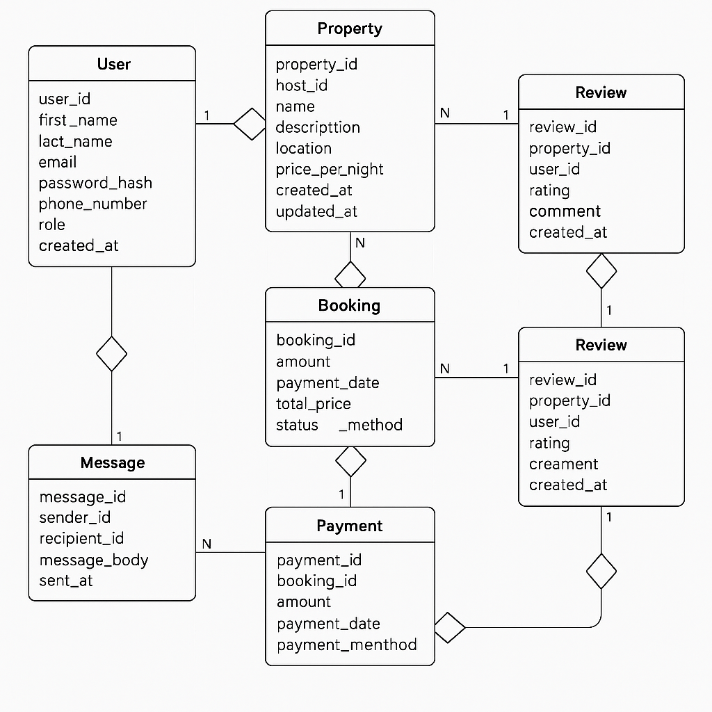

# 🔄 Airbnb Clone Backend — Data Flow Diagram (DFD)

## 📘 Overview
This document illustrates the **Data Flow Diagram (DFD)** for the Airbnb Clone backend system.  
It visualizes how data moves between users, backend processes, databases, and external services such as the payment gateway.

The DFD helps understand how information flows through the system — from user input to storage, processing, and output.

---

## 🧩 Entities in the Diagram

### 1. External Entities
- **Guest:** Registers, books, and reviews properties.
- **Host:** Lists and manages properties.
- **Admin:** Manages users, listings, and reports.
- **Payment Gateway:** Handles all payment transactions securely.

### 2. Processes
- **User Management:** Handles registration, authentication, and profile updates.
- **Property Management:** Allows hosts to add, edit, and remove property listings.
- **Booking Management:** Manages property availability, reservations, and cancellations.
- **Payment Processing:** Sends and receives payment details via the payment gateway.
- **Review Management:** Stores user feedback and ratings after stays.
- **Notification Service:** Sends confirmation emails and alerts.

### 3. Data Stores
- **User Database** — Stores user accounts and roles (Guest, Host, Admin)
- **Property Database** — Stores property details, images, and availability
- **Booking Database** — Stores booking records and statuses
- **Payment Database** — Stores payment transactions and receipts
- **Review Database** — Stores guest feedback and ratings

---

## 🔁 Data Flow Summary

| Data Flow | From | To | Description |
|------------|------|----|-------------|
| Registration Data | Guest/Host | User Management | User submits registration details |
| User Info | User Management | User Database | Stores account credentials |
| Property Data | Host | Property Management | Host creates or updates property |
| Booking Request | Guest | Booking Management | Guest books property |
| Booking Record | Booking Management | Booking Database | Stores booking data |
| Payment Details | Booking Management | Payment Gateway | Initiate payment |
| Payment Confirmation | Payment Gateway | Payment Processing | Confirm payment success |
| Notifications | System | Guest/Host | Sends confirmation email or alert |

---

## 🗺️ DFD Visual

Below is the Level 0 Data Flow Diagram for the Airbnb backend system:

---

## 🧰 Tools Used
- **Draw.io (Diagrams.net)** — for creating the diagram  
- **Markdown** — for documentation formatting  
- **Git & GitHub** — for version control and submission  

---

## 👨‍💻 Author
**Adesina Olagunju**  
Backend Developer | ALX Software Engineering Program
